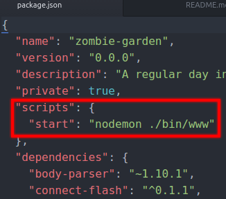
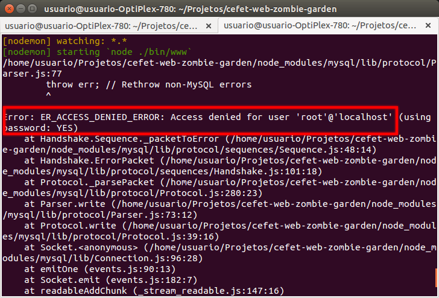

# cefet-web-zombie-garden

Um dia normal no Jardim Zumbi (fictício).


## Atividade

Você deve implementar as funcionalidades faltantes do Jardim Zumbi, que são:
1. A rota e a lógica de banco de dados para **excluir uma pessoa**
1. A rota e a lógica de banco para **adicionar uma pessoa**

Ambos os exercícios devem ser feitos no arquivo `routes/people.js`, onde
estão definidas todas as rotas relativas ao recurso `person`.

Primeiramente, faça um _fork_ deste repositório no GitHub e clone-o
para seu computador.

## Pré-requisito: MySQL Server

Você vai precisar de um computador com o MySQL Server instalado, além do
_setup_ tradicional do Node.js presente nos melhores computadores.

- No Linux (_Debian based_) é facinho:
  ```
  $ sudo apt-get update
  $ sudo apt-get install -y mysql-server
  ```
  - Neste momento, uma tela sensacional será aberta perguntando qual a
    **senha** deve ser atribuída ao **usuário `root`**. Sugiro usar a <u>mesma
    senha do usuário `root`</u> do sistema operacional
    - Claro, não faça isso em um servidor web de verdade ;)
- No Windows, sugiro baixar o
  [instalador do MySQL Server](https://dev.mysql.com/downloads/installer/)
  no site oficial
- No OS X, [eu não sei como fazer :3](https://dev.mysql.com/doc/refman/5.7/en/osx-installation-pkg.html)

Quando instalado, o MySQL expõe uma CLI (_command line interface_) que é
acessível pelo nome de `mysql`. Para verificar que ele está funcionando
devidamente e validar este passo do trabalho, execute:
```
$ mysql -u root -p
```
  - Esse comando nos traz para um ambiente onde podemos executar comandos
  contra os bancos de dados presentes na instância do MySQL que acabamos
  de instalar. Por exemplo:
  ```
  $ mysql> show databases;
  ```

Se você chegou até aqui, segure na mão de Deus e continue.

## Banco de dados

A aplicacao requer um banco de dados MySQL e você deve usar o arquivo
`script-to-create-db.sql` para criar uma instância do banco com alguns
dados pré-populados. Para isso, em linha de comando:

```
$ mysql -u root -p < script-to-create-db.sql
```

Para verificar que tudo está certo como deveria ser:

```
$ mysql -u root -p
$ mysql> show databases;
$ mysql> use zombies;
$ mysql> select * from person;
```
  - E você deve ver uma lista com algumas pessoas da tabela `person`

Com tudo certo, siga adiante, bravo(a) programador(a).

## Instruções de execução

Tente executar a aplicação usando o comando a seguir e repare que não
funcionará:

```
$ npm start
```
  - O motivo do erro é que as dependências do projeto ainda não estão
    instaladas

Em seguida, instale as dependências do projeto, que já foram definidas no
arquivo `package.json`:

```
$ npm install
```

Agora, tente executar novamente. Outra vez, um erro teimoso:

  - Desta vez, vamos usar um pacote chamado `nodemon` para executar
    a aplicação, em vez do próprio `node`
  - Motivo: o `node` fecha sozinho sempre que uma exceção não tratada é
    lançada. O `nodemon` (_node monitor_) executa o programa e dá _restart_
    no Node.js caso ele se encerre abruptamente

Instale de forma global o `nodemon`:

```
$ npm install -g nodemon
```

Para acionar o servidor, você poderia executar `nodemon bin/www.js`. Contudo,
repare que o arquivo `package.json` contém uma propriedade `scripts.start`,
cujo valor é exatamente `nodemon bin/www`:



Sendo assim, basta executar:

```
$ npm start
```
  - ...e o `npm` executará exatamente o que está no `package.json`


Isso acionará o `nodemon` e manterá o `node` em execução para sempre.
Além disso, o `nodemon` reinicia o servidor sempre que detecta alterações
no código fonte, fazendo com que não seja necessário parar o servidor e
abri-lo novamente.

Provavelmente esta execução da aplicação ainda não funcionou. O motivo:
precisamos instalar o módulo com o _driver_ para o MySQL:

```
$ npm i mysql --save
```

Executando novamente a aplicação, nos deparamos com isto:

  - Motivo: a aplicação `cefet-web-zombie-garden` acessa o banco de dados
    a partir de um certo usuário e senha e esse erro indica que o
    usuário/senha usados pela aplicação não estão corretos

Para corrigir este problema, abra o arquivo `db.js` na raiz do projeto
e configure devidamente os dados de conexão com o banco de dados -
possivelmente você deve precisar apenas de colocar a senha do
usuário `root` do MySQL.

Agora sim, execute a aplicação sem erros:

```
$ npm start
```

A aplicação abre na porta 3000. Portanto, visite: http://localhost:3000/ e
faça sua primeira visita ao Jardim Zumbi.

## FAQ

- **Pergunta**: Professor, por quê não disponibilizar o código com tudo
  configuradinho de primeira? Você gosta de ver os alunos perdendo tempo?
  - **Resposta**: objetivos pedagógicos :scream:
- **Pergunta**: Esse MySQL ridículo só tem linha de comando?? Cadê as
  interfaces gráficas tão prometidas??
  - **Resposta**: [MySQL Workbench](https://www.mysql.com/products/workbench/)
    :smirk:
- **Pergunta**: Professor, a linguagem `['Java', 'C#', 'C'].pick()` me deixa
  depurar meu programa para que eu veja direitinho o que está acontecendo,
  passo a passo. Node.js é um lixo!
  - **Resposta**: [engana-se muito](#debugging), jovem Padawan
- **Pergunta**: Estou no arquivo `routes/people.js` e criei uma rota
  de `POST` para `/people`. Mas quando eu envio o formulário para cadastro de
  nova pessoa, estou recebendo mensagem de erro 404 (rota inexistente).
  #comofaz?
  - **Resposta rapidinha**: crie a rota para a URL `/` em vez de `/people`
  - **Resposta bacana**: para aplicações mais grandinhas em Express.js, convém
    deixar o código da aplicação bem organizado e dividido em vários arquivos.
    Neste caso do código do Jardim Zumbi, as rotas estão divididas entre os
    arquivos da pasta `routes/` (`index.js`, `people.js` e `zombies.js`). Se
    você abrir o arquivo na raiz do projeto `/app.js`, verá:

    ```js
    var routes = require('./routes/index');
    var people = require('./routes/people');
    var zombies = require('./routes/zombies');
    // ...
    app.use('/', routes);         // rotas da página inicial
    app.use('/people', people);   // rotas das páginas que começam com "/people"
    app.use('/zombies', zombies); // rotas das páginas que começam com "/zombies"
    ```

    Dentro de cada arquivo da pasta `routes`, estamos instanciando um
    [`express.Router()`](http://expressjs.com/pt-br/guide/routing.html#express-router)
    do Express.js que nos permite definir rotas para um certo prefixo
    (e.g., `'/'`, `'/people'`, `'/zombies'` etc.).

    Assim, uma rota definida pelo roteador que está em `routes/people.js` para
    a URL `'/'`, está, na verdade, sendo uma rota para a URL `'/people/'`.
    Se for `'/new'`, é na verdade `'/people/new'` e assim por diante.
- **Pergunta**: Estou usando `req.params.XXX` para pegar o nome da pessoa que
  deve ser cadastrada no banco, mas está vindo sempre `undefined`. Por quê?
  - **Resposta**: o nome da pessoa está sendo enviado por um formulário
    via método `POST` (para tudo que está fazendo e abra o arquivo
    `views/newPerson.hbs`).

    Para recuperar algo enviado via `POST` no Express.js, você deve usar
    [`req.body.XXX`](http://expressjs.com/pt-br/4x/api.html#req.body)
    (o `req.params.XXX` recupera parâmetros da rota, tipo
    `/people/:idDaPessoa`).
- **Pergunta**: Mesmo lendo a resposta anterior, ainda não sei o que colocar no
  `req.body.XXX`. O que é esse `XXX`?
  - **Resposta**: cada campo (`input`) do formulário sendo enviado (no caso,
    o `form` em `views/newPerson.hbs`) possui um atributo chamado `name` que
    contém o nome do campo que será recebido na rota. **Não confunda o
    atributo HTML `name` com o atributo `id`**: para formulários, o `id` não
    tem nenhuma utilidade, mas o `name` sim.

## _Debugging_

Se quiser fazer _debugging_, instale o `node-inspector` globalmente:

```
$ npm install -g node-inspector
```

E, na hora de iniciar a aplicação, em vez de usar `npm start`, use:

```
$ node-debug bin/www
```
